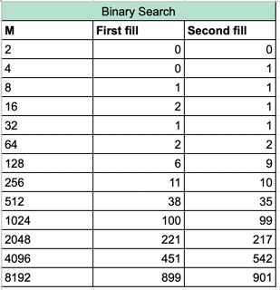
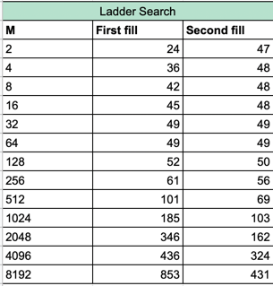
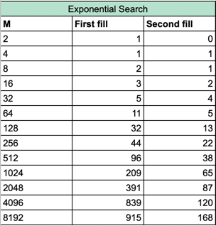
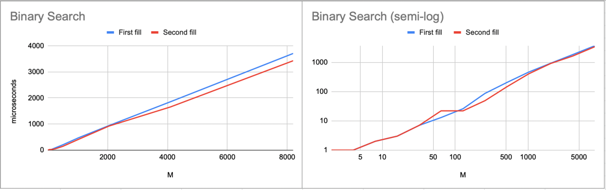
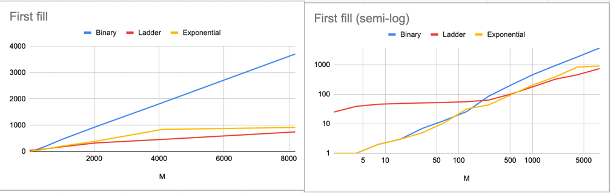
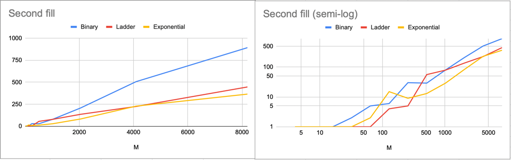

# Отчет

## Реализации заполнений
* _A[i][j] = (N/M * i + j) * 2_

https://github.com/ProbablyDead/algorithm/blob/cdcbca7d4734c92dcfb53fa770777a4ad6463cfb/array/arrOpt.cpp#L4-L12

* _A[i][j] = (N/M * i * j) * 2_

https://github.com/ProbablyDead/algorithm/blob/f8e4a7baf4124ca099a6d5a773354c5447520a6f/array/arrOpt.cpp#L14-L22

---

## Реализации Алгоритмов

* _Бинарный поиск_ - O(M*log(N))

https://github.com/ProbablyDead/algorithm/blob/f8e4a7baf4124ca099a6d5a773354c5447520a6f/algorithm/binary/binary.cpp#L7-L18

* _Поиск лесенкой_  - O(M+N)

https://github.com/ProbablyDead/algorithm/blob/f8e4a7baf4124ca099a6d5a773354c5447520a6f/algorithm/ladder/ladder.cpp#L7-L17

* _Экспоненциальный поиск_ - O(M*log(N))

https://github.com/ProbablyDead/algorithm/blob/f8e4a7baf4124ca099a6d5a773354c5447520a6f/algorithm/exponentional/exp.cpp#L21-L29

---

> ### Запуски алгоритмов и замеры времени
>
> * _Бинарный поиск_
> 
> https://github.com/ProbablyDead/algorithm/blob/369fb63aef69fb3b4c17691d6b70604cfd24dd8c/algorithms/binary/binary.cpp#L28-L46
> 
> * _Поиск лесенкой_
> 
> https://github.com/ProbablyDead/algorithm/blob/369fb63aef69fb3b4c17691d6b70604cfd24dd8c/algorithms/ladder/ladder.cpp#L19-L37
>
> * _Экспоненциальный поиск_
> 
> 

---

## Замеры (в микросекундах)

* _Бинарный поиск_

* _Поиск лесенкой_

* _Экспоненциальный поиск_

---

## Визуализация

* _Бинарный поиск_

* _Поиск лесенкой_

* _Экспоненциальный поиск_

---

## Зависимость от заполнения

* _A[i][j] = (N/M * i + j) * 2_

* _A[i][j] = (N/M * i * j) * 2_

---

## _Выводы_

* Заметно, что различия во времени выполнения между одним алгоритмом, работающим на разных данных различаются, 
в основном `второе заполнение работает быстрее`, за исключением бинарного поиска, думаю тут дело в нулях в первой строке
и первом столбце.
* Замечу факт, что бинарный поиск работает почти в `2 раза медленнее` конкурентов на больших данных, так как никаких 
смещений по строкам нет 
и приходится искать в каждой.
* Бинарный очень неплохо справляется `с малыми объемами данных` (~ М < 100).
* Самым быстрым почти на всех этапах оказался `экспоненциальный поиск`, кроме значений `m < 350` на втором заполнении. 
Думаю, это происходит потому, что в отличие от лесенки, экспоненциальный поиск пропускает большие объемы данных, 
но на малых данных он не успевает "набрать обороты" и не пропускает большую часть данных, к тому же его достаточно сильно 
замедляет бинарный поиск на больших объемах.

> __Итого:__ Самым быстрым оказался `экспоненциальный поиск` почти на всех данных,
> самым медленным на малых данных - `поиск лесенкой`, самым медленным на больших - бинарный.
> Но не стоит исключать тот факт, что экспоненциальный я, возможно, запускал с меньшим количеством открытых программ на ПК. 

### P.S. Excel report is [here](https://docs.google.com/spreadsheets/d/1FrxqawflBV525azESpkDQXcTIUvimMBtfz8EOFm53jg/edit?usp=sharing)
