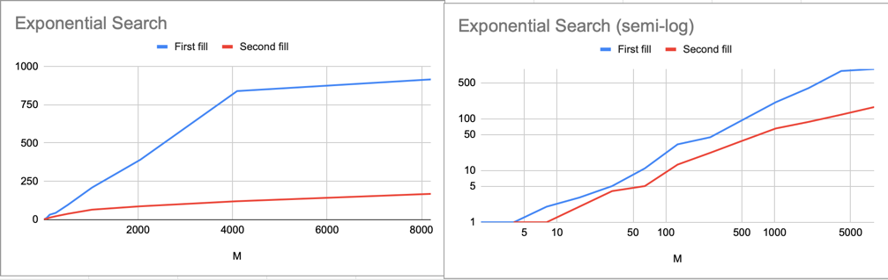

# Отчет

## Реализации заполнений
* _A[i][j] = (N/M*i + j)*2_

https://github.com/ProbablyDead/algorithm/blob/cdcbca7d4734c92dcfb53fa770777a4ad6463cfb/array/arrOpt.cpp#L4-L12

* _A[i][j] = (N/M*i*j)*2_

https://github.com/ProbablyDead/algorithm/blob/f8e4a7baf4124ca099a6d5a773354c5447520a6f/array/arrOpt.cpp#L14-L22

---

## Реализации Алгоритмов

* _Бинарный поиск_ - O(M*log(N))

https://github.com/ProbablyDead/algorithm/blob/f8e4a7baf4124ca099a6d5a773354c5447520a6f/algorithm/binary/binary.cpp#L7-L18

* _Поиск лесенкой_  - O(M+N)

https://github.com/ProbablyDead/algorithm/blob/f8e4a7baf4124ca099a6d5a773354c5447520a6f/algorithm/ladder/ladder.cpp#L7-L17

* _Экспоненциальный поиск_ - O(M*log(N))

https://github.com/ProbablyDead/algorithm/blob/f8e4a7baf4124ca099a6d5a773354c5447520a6f/algorithm/exponentional/exp.cpp#L21-L29

---

## Замеры (в микросекундах)

* _Бинарный поиск_

* _Поиск лесенкой_

* _Экспоненциальный поиск_

---

## Визуализация

* _Бинарный поиск_

* _Поиск лесенкой_

* _Экспоненциальный поиск_

---

## Зависимость от заполнения

* _A[i][j] = (N/M*i + j)*2_

* _A[i][j] = (N/M*i*j)*2_

---

## _Выводы_

---

### Excel document is [here](https://docs.google.com/spreadsheets/d/1FrxqawflBV525azESpkDQXcTIUvimMBtfz8EOFm53jg/edit?usp=sharing)
