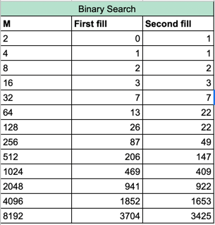
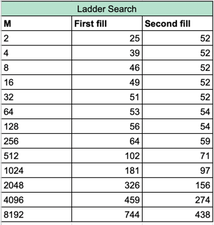
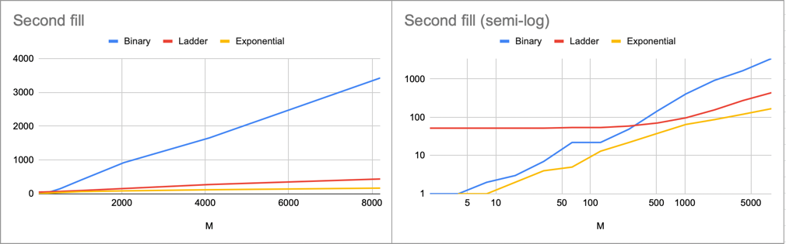

# Отчет

### Excel report is [here](https://docs.google.com/spreadsheets/d/1FrxqawflBV525azESpkDQXcTIUvimMBtfz8EOFm53jg/edit?usp=sharing)

---

## Реализации заполнений
* _A[i][j] = (N/M * i + j) * 2_

https://github.com/ProbablyDead/algorithm/blob/25f5c39e19ff25c2f452321cbbd190c832a489b3/array/arrOpt.cpp#L4-L14

* _A[i][j] = (N/M * i * j) * 2_

https://github.com/ProbablyDead/algorithm/blob/2031ea8f0a516cd75d2720de00afaef3ea3c15b1/array/arrOpt.cpp#L16-L26

---

## Реализации Алгоритмов

* _Бинарный поиск_ - O(M*log(N))

https://github.com/ProbablyDead/algorithm/blob/2e45a762fe9b9c65d3d55c2433de6671fc479c87/algorithms/binary/binary.cpp#L6-L25

* _Поиск лесенкой_  - O(M+N)

https://github.com/ProbablyDead/algorithm/blob/10d9ad1d873551343b5eef60de5cda6768e4da0b/algorithms/ladder/ladder.cpp#L6-L16

* _Экспоненциальный поиск_ - O(M*log(N))

https://github.com/ProbablyDead/algorithm/blob/d75f1d024b78f3711ab86af36883202dc5c9277f/algorithms/exponentional/exp.cpp#L32-L53

> Бинарный поиск по столбцу
> https://github.com/ProbablyDead/algorithm/blob/47702eda732af2c102a525eb1380293875dd762b/algorithms/exponentional/exp.cpp#L26-L43

---

> ### Запуски алгоритмов и замеры времени
>
> * _Бинарный поиск_
> 
> https://github.com/ProbablyDead/algorithm/blob/25f5c39e19ff25c2f452321cbbd190c832a489b3/algorithms/binary/binary.cpp#L28-L46
> 
> * _Поиск лесенкой_
> 
> https://github.com/ProbablyDead/algorithm/blob/10d9ad1d873551343b5eef60de5cda6768e4da0b/algorithms/ladder/ladder.cpp#L18-L36
>
> * _Экспоненциальный поиск_
> 
> https://github.com/ProbablyDead/algorithm/blob/d75f1d024b78f3711ab86af36883202dc5c9277f/algorithms/exponentional/exp.cpp#L55-L73
> 

---

## Замеры (в микросекундах)

* _Бинарный поиск_

* _Поиск лесенкой_

* _Экспоненциальный поиск_

---

## Визуализация

* _Бинарный поиск_

* _Поиск лесенкой_

* _Экспоненциальный поиск_

---

## Зависимость от заполнения

* _A[i][j] = (N/M * i + j) * 2_

* _A[i][j] = (N/M * i * j) * 2_

---

## _Выводы_

* Заметно, что все алгоритмы, кроме `бинарного`, имеют большую разность во времени выполнения на больших данных, 
что хорошо заметно на графике экспоненциального поиска. Думаю, это обусловлено большими значениями при втором заполнении,
следовательно, пропускаются бóльшие объемы данных.
* С `меньшими объемами данных` хуже всего справляется поиск `лесенкой`, возможно из-за большого числа операций на маленьких М.
* На тех же данных `бинарный` и `экспоненциальный` поиски справляются почти одинаково, но при втором заполнении бинарный 
работает почти `в 2 раза хуже линейного` и `в 4 экспоненциального`, думаю, это вызвано тем, что независимо от количества строк,
он проходит одно и то же количества элементов в каждой из них.
* На втором заполнении `экспоненциальный` работает `гораздо быстрее конкурентов`, 
но `на первом выполняется заметно хуже остальных`, что обусловлено довольно маленькой разностью между значениями соседних
элементов строки, а следовательно и небольшими смещениями по массиву.

> ## ___Итог___
> 1. Самый _неэффективный_ алгоритм на маленьких данных - __лесенка__
> 2. Самые _эффективные_ алгоритмы на маленьких данных - __бинарный__ (на первом заполнении) и __экспоненциальный__ (на втором)
> 3. Самый _неэффективный_ алгоритм на больших данных - __бинарный__
> 4. Самые _эффективные_ алгоритмы на больших данных - __лесенка__ (на первом заполнении) и __экспоненциальный__ (на втором)
> 